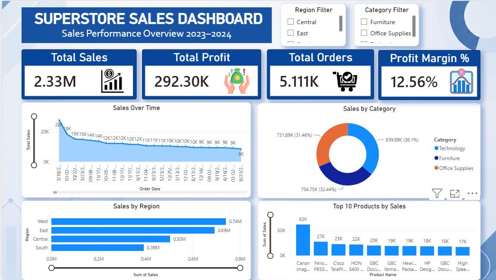

# Superstore Sales Dashboard

## Overview

An interactive Power BI dashboard built using the Superstore dataset to analyze sales performance, profitability, product trends, and regional performance.

## Dashboard Preview

## Key Metrics

- Total Sales: 2.33M
- Total Profit: 292.30K
- Total Orders: 5,111
- Profit Margin: 12.56%

## Features

- Sales Trend Analysis
- Category-wise Sales Distribution
- Regional Performance Analysis
- Top 10 Products by Sales
- Interactive Region and Category Filters

## Tools Used

- Power BI
- DAX
- Excel

## Author

Sandeep Tiwari
